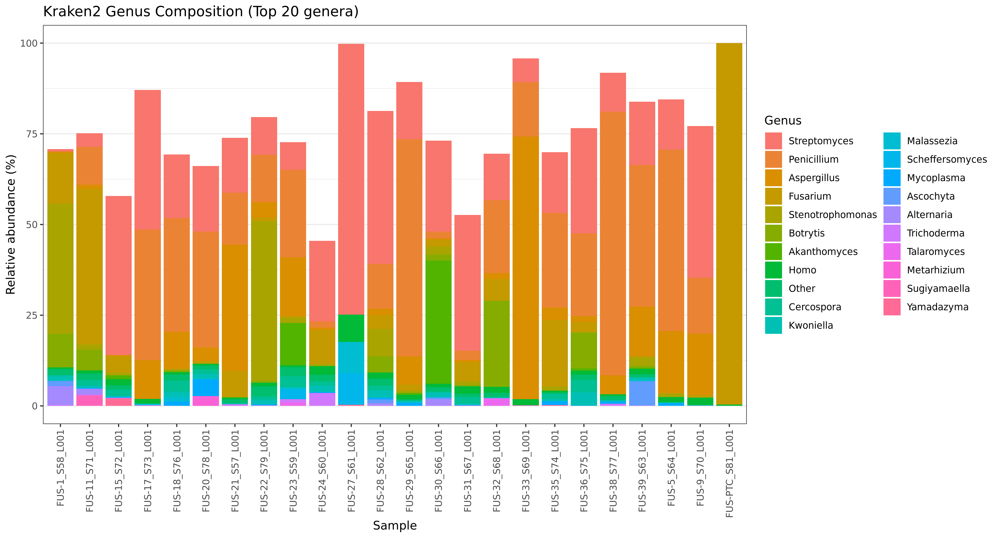
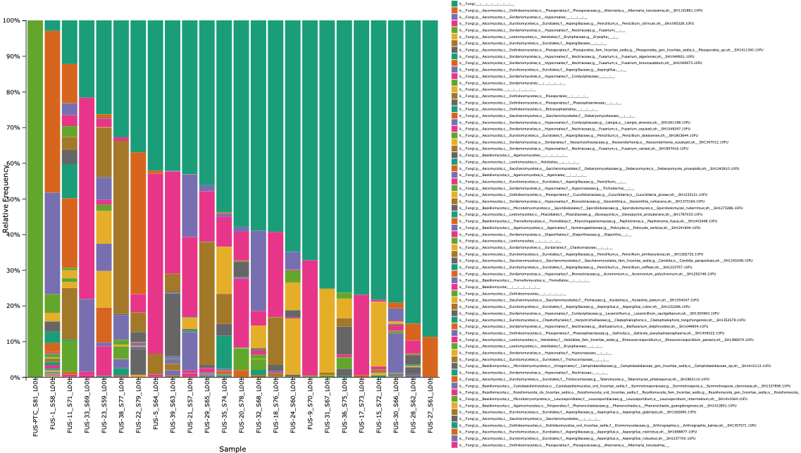

# MicrobiomeAnalysis
The goal of this project is to classify Fusarium species at the highest possible taxonomic resolution from crude cannabis DNA extracts. These results are integrated with mycotoxin presence/absence and additional metadata to better understand the role of Fusarium in cannabis production.

# Data
You can download the data from this link.*****

# Taxonomic Classification of Sequencing Reads
For the taxonomic assignment of metagenomic reads, I utilize Kraken2, a k-mer–based tool that provides fast and high-accuracy classification by matching sequencing reads against a comprehensive genomic database. Its primary purpose is to process raw DNA reads (e.g., FASTQ files) and determine which organisms are present and their relative abundance within a sample.

Kraken2 is widely applied in microbiome, environmental, and pathogen detection studies, where understanding the composition and diversity of organisms is the main objective.

### It enables:
- Taxonomic assignment of reads to organisms (e.g., bacteria, fungi, viruses)
- Profiling of microbial communities in metagenomic datasets
- Detection of specific taxa or potential contaminants in sequencing data

Within the Kraken2 workflow, raw reads are taxonomically classified using a prebuilt database that includes the standard database along with RefSeq, protozoa, fungi, and plant sequences.

## Taxonomic Classification Results  
The figure shows the genus-level taxonomic composition of all samples based on Kraken2 classification, displaying the top 20 most abundant genera. Each bar represents a sample, and colors indicate different genera, with the y-axis showing relative abundance (%).

Across samples, several genera dominate the community structure, particularly Fusarium, Aspergillus, Penicillium, and Streptomyces, reflecting a strong fungal presence consistent with your dataset focus. Some samples show high dominance by a single genus, while others exhibit more diverse compositions. Minor genera and less abundant taxa are grouped as “Other,” highlighting overall community complexity.

This visualization demonstrates variation in microbial composition between samples, enabling comparison of dominant taxa and identification of patterns such as enrichment of specific genera or potential contaminants (e.g., Homo or Mycoplasma).


```bash

## 1. Download Kraken2 Database
wget https://genome-idx.s3.amazonaws.com/kraken/k2_pluspf_20260226.tar.gz
tar -xvzf k2_pluspf_20260226.tar.gz

# Check database content
cut -f1 library_report.tsv | sort | uniq -c

## 2. Run Kraken2
sbatch kraken2.sh

```
# Amplicon-Based Microbiome Analysis
To process and analyze amplicon sequencing data (e.g., 16S rRNA, ITS, and EF1α) to identify and quantify microbial and fungal communities within a sample, QIIME 2 is used. Its main purpose is to convert raw sequencing reads (FASTQ files) into biologically meaningful outputs such as amplicon sequence variants (ASVs), taxonomic assignments, and community composition profiles.

QIIME 2 provides a reproducible, high-resolution, and widely accepted framework for microbiome analysis. It is specifically designed to handle marker-gene datasets and allows accurate reconstruction of sequences while minimizing sequencing errors. Compared to traditional OTU-based approaches, QIIME 2 uses ASVs, which improves taxonomic resolution and consistency across studies.

It is used in this project because it enables:

- End-to-end analysis from raw reads to final taxonomic profiles  
- High-resolution sequence inference using denoising methods (e.g., DADA2)  
- Integration with curated reference databases (e.g., SILVA, UNITE, FusarioidID)  
- Reproducible and transparent workflows suitable for research and publication  
- Interactive visualization of microbiome composition across samples  

Within the QIIME 2 workflow, reads are first trimmed to remove adapter and primer sequences, then separated into independent datasets based on target amplicons (EF1α, ITS1, and ITS2). Reads are quality-filtered, and paired-end reads are merged during denoising.

ITS1 and ITS2 sequences are classified using a Naive Bayes classifier trained on fungal sequences from the UNITE database clustered at 99% identity.

EF1α amplicons are classified using a Naive Bayes classifier trained on the Fusarioid ID database (latest version), filtered to include only EF1α sequences:
https://www.fusarium.org/page/Sequencesindatabase

Evaluation of the EF1α classifier on the reference dataset achieved a precision of 0.98 and recall of 0.92 for species-level classification.

## Phylogenetic Tree Construction

Phylogenetic trees were generated from the filtered representative ASV sequences obtained after QIIME 2 processing. For the combined analysis, sequences from all samples were aligned using Clustal Omega, and poorly aligned regions were removed with trimAl. A maximum likelihood phylogenetic tree was then constructed using IQ-TREE2 with automatic model selection (ModelFinder) and branch support assessed using ultrafast bootstrap and SH-aLRT tests (1000 replicates each). In addition to the combined dataset, trees were also constructed separately for each sample by first filtering sample-specific ASVs and repeating the same alignment and tree-building procedure. This approach enables both global comparison of diversity across all samples and detailed evaluation of within-sample variation.

```bash

## 1. Download EF1α Database
wget http://www.fusarium.org/images/alignments/sequencesindatabase10022026.zip
unzip sequencesindatabase10022026.zip

## 2. Download ITS Database (UNITE)
mkdir UNITE_QIIME && cd UNITE_QIIME
# Download: sh_qiime_release_19.02.2025.tgz from:
# https://doi.plutof.ut.ee/doi/10.15156/BIO/3301241
tar -xvzf sh_qiime_release_19.02.2025.tgz
cd ..

## 3. Run QIIME2 (all samples)
sbatch qiime2.sh EF1
sbatch qiime2.sh ITS1
sbatch qiime2.sh ITS2

## 4. Run QIIME2 (per sample)
sbatch qiime2_per_sample.sh EF1
sbatch qiime2_per_sample.sh ITS1
sbatch qiime2_per_sample.sh ITS2

```
## Amplicon-Based Microbiome Analysis Results  

### ITS2 Taxonomic Composition
The ITS2-based taxonomic profiling reveals substantial variation in fungal community composition across samples. Most samples are dominated by a single taxon, indicating strong enrichment patterns rather than evenly distributed communities. A large proportion of samples show high relative abundance of Ascomycota-affiliated taxa, with multiple samples approaching near-complete dominance by a single family-level group.

In contrast, a subset of samples displays more diverse profiles, with multiple taxa contributing to the overall composition. These mixed communities are characterized by moderate proportions of several fungal groups rather than a single dominant lineage.

*Generated from `ITS2-taxa-barplot.qzv` using QIIME 2 View (https://view.qiime2.org/).*



### Phylogenetic Tree
Phylogenetic trees were inferred using **IQ-TREE** (maximum-likelihood) and visualized using **iTOL** (https://itol.embl.de/). Alternatively, tree visualization can be performed locally using the provided R script (`tree_visualize.R`).

